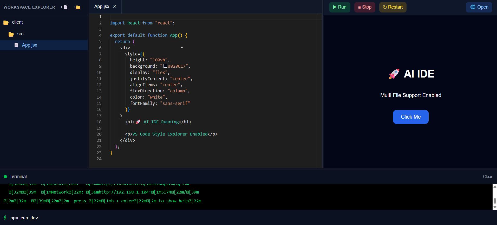
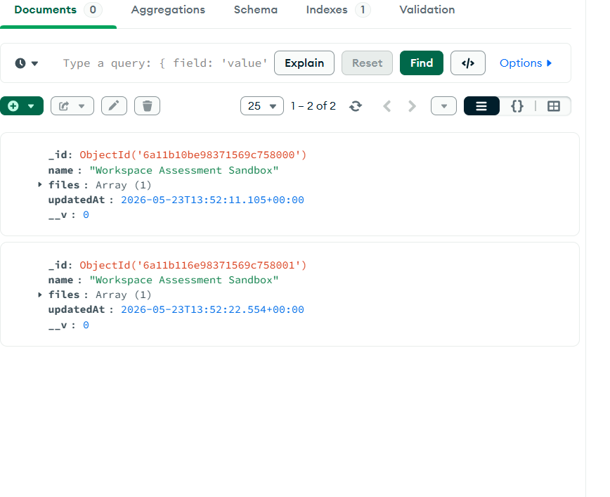

```markdown
# 🚀 Full-Stack AI Sandbox IDE with Live MERN Synchronization

A responsive, browser-based sandbox development environment built with React, Vite, and Tailwind CSS. It features a dynamic VS Code-style file explorer, live code execution previews, and a debounced real-time cloud sync engine powered by Node.js, Express, and MongoDB Atlas.

---

## 🏗️ Project Architecture & Directory Layout

The workspace is organized as a unified monorepo structured specifically for seamless local execution and optimized serverless deployment via Vercel:

```text
CLIENT (Root Folder)
├── 📁 node_modules/          # Frontend dependencies
├── 📁 public/                # Static public assets
├── 📁 server/                # Backend API microservice
│   ├── 📁 node_modules/      # Backend dependencies
│   ├── 📄 .env               # Secret database environment strings (git-ignored)
│   ├── 📄 package.json       # Node API dependencies & startup scripts
│   └── 📄 server.js          # Core Express application and MongoDB schemas
├── 📁 src/                   # React frontend codebase
│   ├── 📁 assets/            # UI icons and custom images
│   ├── 📁 components/        # Isolated modular UI components
│   │   ├── 📄 Editor.jsx     # Code editor canvas wrapper
│   │   ├── 📄 Preview.jsx    # Live compilation iframe context
│   │   ├── 📄 Sidebar.jsx    # Dynamic hierarchical file explorer tree
│   │   └── 📄 Terminal.jsx   # Virtual console output interface
│   ├── 📁 lib/               # Third-party integrations
│   │   └── 📄 webcontainer.js# WebContainer configuration runtime
│   ├── 📁 store/             # Global application state management (Zustand)
│   │   ├── 📄 useProjectStore.js # Main project file-tree & cloud sync engine
│   │   └── 📄 useTerminalStore.js# Terminal lifecycle state management
│   ├── 📄 App.css            # Layout-specific interface variables
│   ├── 📄 App.jsx            # Layout scaffold dashboard setup
│   ├── 📄 files.js           # Static baseline data fallback definitions
│   ├── 📄 index.css          # Tailwinds core directives & styling configurations
│   └── 📄 main.jsx           # Virtual DOM application mount engine
├── 📄 .gitignore             # Deployment configuration mapping for secure commits
├── 📄 eslint.config.js       # Code formatting rules configurations
├── 📄 index.html             # Main single-page entry canvas
├── 📄 package.json           # Frontend automation scripts & asset lists
└── 📄 vercel.json            # Deployment routing instructions for Vercel

```


---

## 🛠️ Detailed Technical Implementations

### 1. State-Driven Virtual File System (`useProjectStore.js`)

* **Hierarchical Tree Management:** Implemented a deeply nested tree structural data array to emulate operating-system-level file systems natively in JavaScript.
* **Recursive Modifiers:** Engineered explicit recursive utility functions (`toggleFolderRecursive`, `addFileRecursive`, `addFolderRecursive`, `deleteRecursive`, `updateFileRecursive`, `renameRecursive`) to execute O(N) lookup and mutation complexity down specific branches of the folder state hierarchy without mutating state directly.

### 2. High-Performance Debounced Cloud Sync Engine

* **Intelligent Auto-Save Loop:** Linked mutations within the Zustand store directly to an asynchronous fetch network bridge targeting MongoDB Atlas.
* **Network Optimization (Debouncing):** Integrated a high-performance keystroke-throttling mechanism on the active file code-editor handler. When a user types, database synchronization pauses until a 1000ms idle break is reached, protecting network resources from processing bursts and conserving processing power.
* **Persistent ID Identity Tracking:** Configured full lifecycle record persistence. The frontend maintains an active state pointer for `projectId`. The initial code change triggers an upsert operation (`new Project().save()`) in MongoDB, which returns a system-generated ObjectId (`_id`). The store captures this reference, turning subsequent keystrokes into explicit `$set` updates (`findByIdAndUpdate`) to eliminate duplicate documents.

### 3. Dynamic Environment Pipeline (Zero-Env Architecture)

* **Local vs. Cloud Autonomous Routing:** Implemented an automated runtime host check (`window.location.hostname === 'localhost'`).
* **Self-Configuring Network Base URL:** The system automatically establishes API base configurations out-of-the-box. If tested locally, requests route directly to the Express server running at `http://localhost:5000`. If hosted live on Vercel, it dynamically strips the domain origin to execute unified context-relative requests (`/api/projects/save`), eliminating the need to manage separate frontend environment variables.

### 4. Robust Backend Configuration & Storage (`server.js`)

* **Strict Schema Definition:** Enforced clean Mongoose Schemas map shapes directly matching the dynamic workspace definitions:
```javascript
const ProjectSchema = new mongoose.Schema({
  name: { type: String, default: "Untitled Sandbox" },
  files: { type: Array, default: [] },
  updatedAt: { type: Date, default: Date.now }
});

```


* **Decoupled Cross-Origin Resource Sharing (CORS):** Configured permissive credentialed dynamic validation to ensure structural operations run flawlessly across varying development environments and deployment channels.

---

## 🚀 How to Run Locally

### Prerequisites

* Ensure you have [Node.js](https://nodejs.org/) installed.
* Ensure you have a running [MongoDB Compass](https://www.mongodb.com/products/tools/compass) client or MongoDB Atlas instance.

### 🔌 Step 1: Spin up the API Backend Server

1. Open a terminal instance and change into the server folder:
```bash
cd server

```


2. Install necessary dependencies:
```bash
npm install

```


3. Create a `.env` file within the `server/` directory and include your Atlas connection string:
```env
PORT=5000
MONGODB_URI=mongodb+srv://<username>:<password>@cluster0.xichr8y.mongodb.net/leadDistributionDB?retryWrites=true&w=majority

```


4. Fire up the local API runtime engine:
```bash
node server.js

```


*Expected Output:* `💾 Production MongoDB Atlas Connected Safely` & `🚀 Production Sandbox API Running on Port 5000`

### 🌐 Step 2: Spin up the Vite Frontend Sandbox

1. Open a second, independent terminal window at the **root project directory**.
2. Install frontend dependencies:
```bash
npm install

```


3. Boot up the Vite fast-refresh UI server:
```bash
npm run dev

```


4. Open your browser and navigate to `http://localhost:5173`. Create a new folder or adjust text inside `App.jsx`. Wait 1 second, and view your records dynamically update inside **MongoDB Compass** instantly!

---

## ☁️ Deployment Configuration for Vercel

To host this multi-tier application as a unified deployment without separate routing layers, use the project root's custom **`vercel.json`** instructions:

```json
{
  "version": 2,
  "builds": [
    {
      "src": "package.json",
      "use": "@vercel/static-build",
      "config": { "distDir": "dist" }
    },
    {
      "src": "server/server.js",
      "use": "@vercel/node"
    }
  ],
  "routes": [
    {
      "src": "/api/(.*)",
      "dest": "server/server.js"
    },
    {
      "src": "/(.*)",
      "dest": "/index.html"
    }
  ]
}

```

### Final Deployment Checklist:

1. Connect your GitHub workspace directly to your Vercel Dashboard.
2. Under **Project Settings -> Environment Variables**, add your secret cloud production database pointer:
* **Key:** `MONGODB_URI`
* **Value:** *Your actual MongoDB connection string*


3. Click **Deploy**. Vercel will map the static user views and spin up the serverless backend routes automatically!

```

```